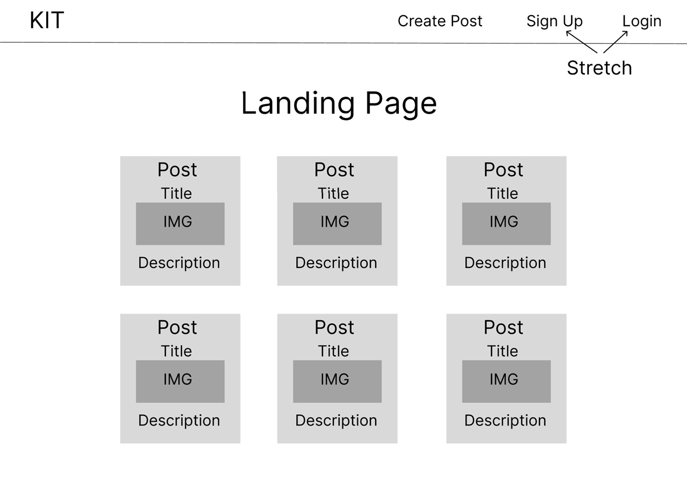
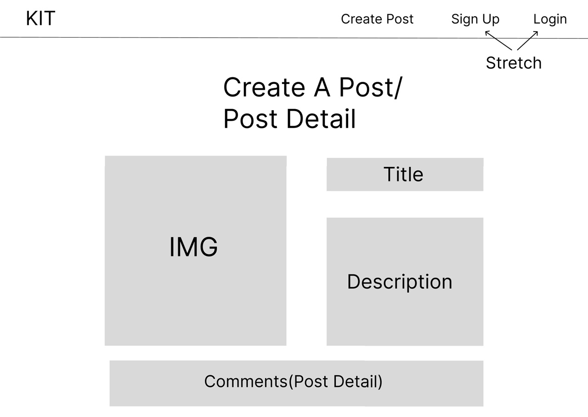
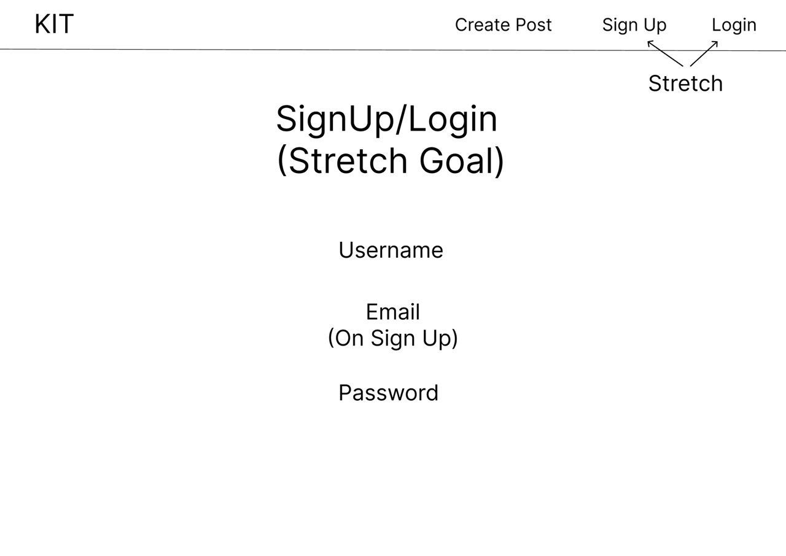
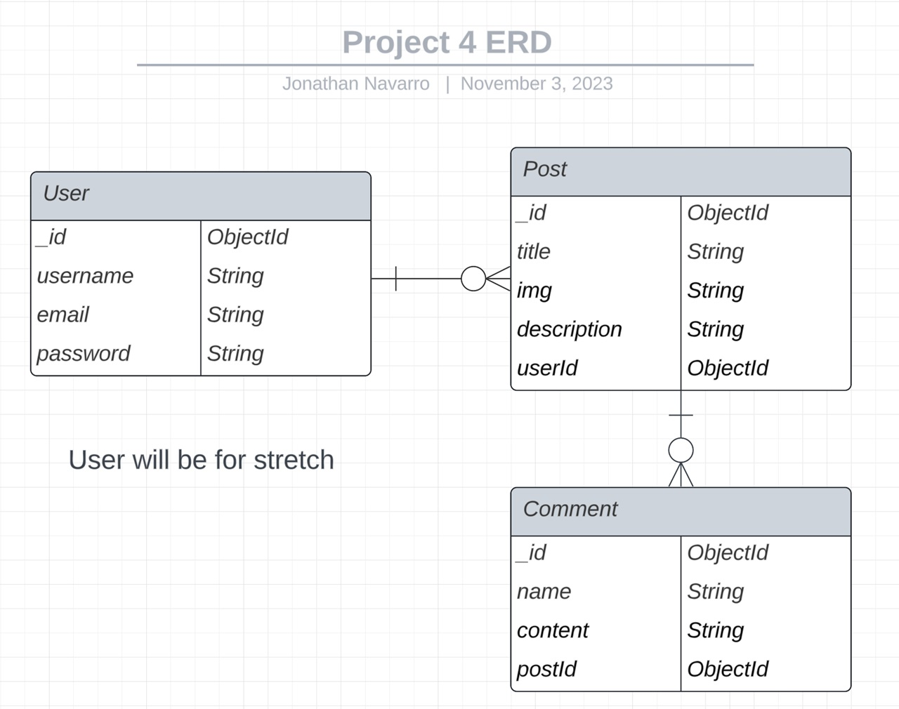

# KIT (Keep In Touch) | Created by: Jonathan Navarro
Link to app: https://keepintouch-8d0a86903f9e.herokuapp.com
### About
KIT was created so individuals could... keep in touch! This is accomplished by users sharing pictures  
they have taken and then other users can then comment on the picture! Once you visit the app,   
you'll see the posts that everyone has created. You can then click on a post to see its description  
and comments users might have added to the post. Users also have the ability to sign up or login.  
Once a user signs up or logs in, they will unlock the ability to create posts, create comments,  
and view other information!

## App Screenshots

## Technologies Used
- Mongoose (MongoDB)
- Express
- React
- NodeJS
- Javascript
- Tailwind CSS
- Chrome Dev Tools
- React Dev Tools

## Installation Instructions
- Only want to view the app?
  - Visit: https://keepintouch-8d0a86903f9e.herokuapp.com
- Want to install the app?
  - Requirements:
    - Github Account
    - Knownledge of git commands
    - Terminal with package installation capabilities
    - Terminal knowledge
    - MongoDB Account and knowledge on how to access account info
    - VSCode
  - Steps:  
  1. Click `Fork` at the top of this page
  2. Click the green `Code` button once the page fully loads
  3. Copy the line that starts with `https://github.com/`
  4. Go to your terminal and navigate to where you wouldn't mind a new folder appearing
  5. Type `git clone link` and replace `link` with the line you copied in `step 3`
  6. cd into the repository that was created
  7. run `npm i` to install the necessary packages
  8. Type `Code .` to open vscode with the current folder
  9. Create a `.env` file at the root of the directory and create the following variables
    * `MONGODBURI="your mongodb connection string here"`
    * `PORT=3000` or a port of your choosing
    * `JWT_SECRET_KEY='Type any key you'd like'` You can start with a key that consists of letters and numbers
  10. Open a VSCode terminal and type `npm run backend`
  11. Open another VSCode terminal and type `npm run frontend`, take note of the address the terminal displays
  12. Open a browser of your choice and navigate to the address the frontend command displayed

## User Stories
- As a photographer, I want a platform where I can show off my pictures so that other people can enjoy the world as I see it.
- As a friend, I want a place where my friends can post pictures so that I may still be connected with them even if we cannot meet.
- As a user of the app, I'd like to be able to comment on posts, so that the post creator may view what others have to say about their post.

## Wireframes

## Unsolved Problems | Major Hurdles
- I had a lot of functionality in mind for stretch goals, but there not enough time.
- I was working on a different branch to allow users to create and join groups,  
 and I had to realize that I wouldn't be able to achieve the functionality by the end of the project.  
 I had to scrap the idea for now and work on styling the app that had met mvp.

## Next Steps
- I want to continue to work on the functionality related to groups, as it would  
get me closer to allowing friends to keep in touch, rather than everyone being able to  
see all posts ever created and also being able to comment on any post.
- I will find other functionality to add later on while I continue to work to bring this idea to life  
as I really loved the vision for this project.